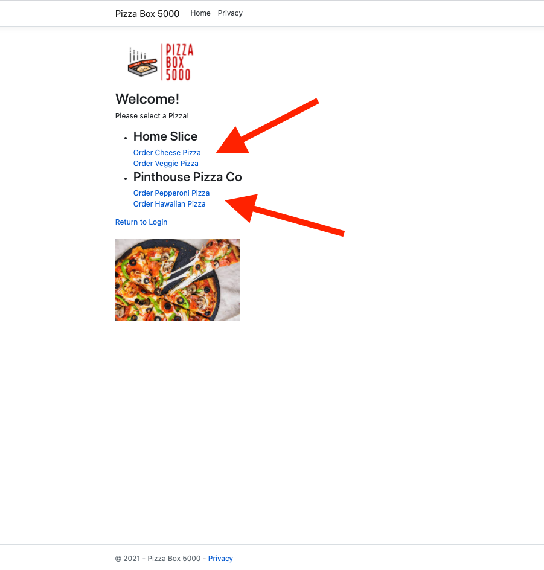

# Pizza Box 5000

## Project Description
Pizza Box 5000 is an MVC application that allows the user to enter their name into a data base and then navigate to an order page to purchase a pizza. Once you have selected a pizza you can review your order and change it if you would like!

## Technologies Used

* C#
* MVC
* ASP.NET Core
* EF Core
* Microsoft SQL Server
* Azure Data Studio
* xUnit Testing

## Features

### Ready Features

* Log your name in a database
* Make a selection from 1 of 4 pizzas
* See and review your pizza order!

### To Do List
* Log orders in database with a specific user
* Make multiple stores
* Create reports for each store

## Getting Started

1.  Clone the repo with "git clone"
2.  CD into "PizzaBox.Client"
3.  Run "dotnet watch run"

## Usage

1. Enter your name and click "Create User"

2. Pick the Pizza of your choice

3. See and review your order, change it if you'd like!

## License

* MIT
